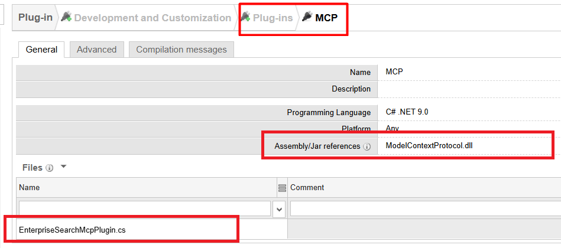
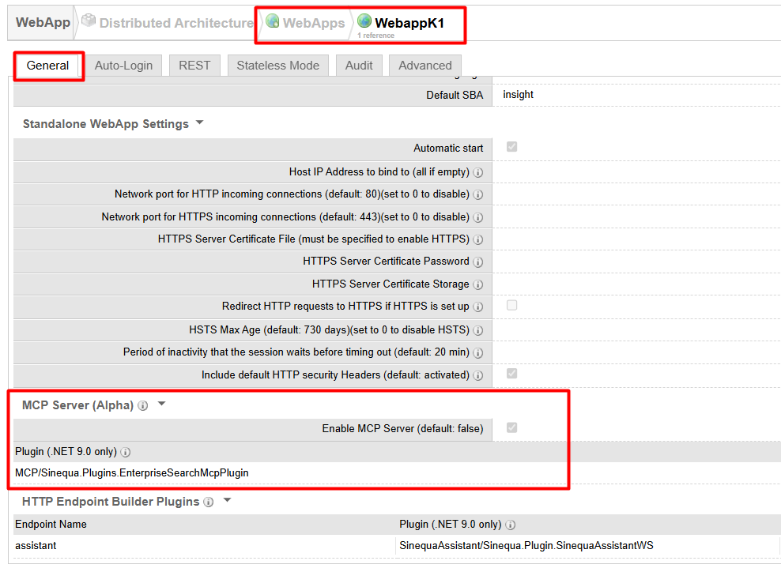
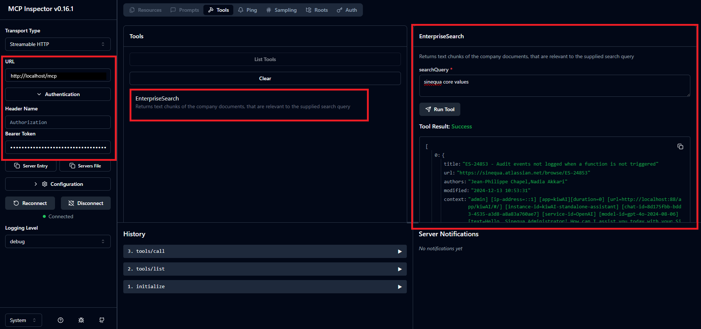

# MCP experimentation

Repository bringing together all the MCP-related experiments within the Sinequa platform.


> [!IMPORTANT]
> **Prerequisites** 
> * Sinequa release >= 11.13.0.2044
> * .NET Core only
> * **Beta** mode
> * Standalone WebApps only

# 11.13.0.2044
The very first integration of MCP capacities within Sinequa WebApps is plugin-based only, i.e. we don’t deliver built-in tools for the moment but only the capacity to add tools by plugin.

# Plugins

In the `plugins` repository can be found implementations of such plugins corresponding to various usecases.

First of all, make sure to add the `<sinequa>\bin\ModelContextProtocol.dll` to the dependency of your plugin, and add the `EnterpriseSearchMcpPlugin.cs` [file](plugins/EnterpriseSearchMcpPlugin.cs)




# How to enable MCP?
To enable MCP capacity in a given WebApp, simply check this option and list the plugin you want to be usable.




Now that your tools are configured, make sure to restart your targeted Sinequa WebApps so it is launched with the MCP capacities.

> [!WARNING]
> When defining a new tool plugin, the restart of the WebApp is mandatory

The serving route is `/mcp`.

# How to use your tool?
First, you are going to need an Access Token for the client. In the Admin, add `/mcp` to the **Allowed JSON Methods** of the Access Token(s) you want to use.

## MCP inspector
Now, you need an MCP client such as MCP inspector which is easily runnable locally using


```
npx @modelcontextprotocol/inspector
```

If you visit the URL logged when starting inspector you should see the following UI  from which you can connect to your Sinequa MCP WebApp, list your tools and execute them.



> [!IMPORTANT]
> Authentication Support
> * Bearer Token
> * OAuth will coming soon